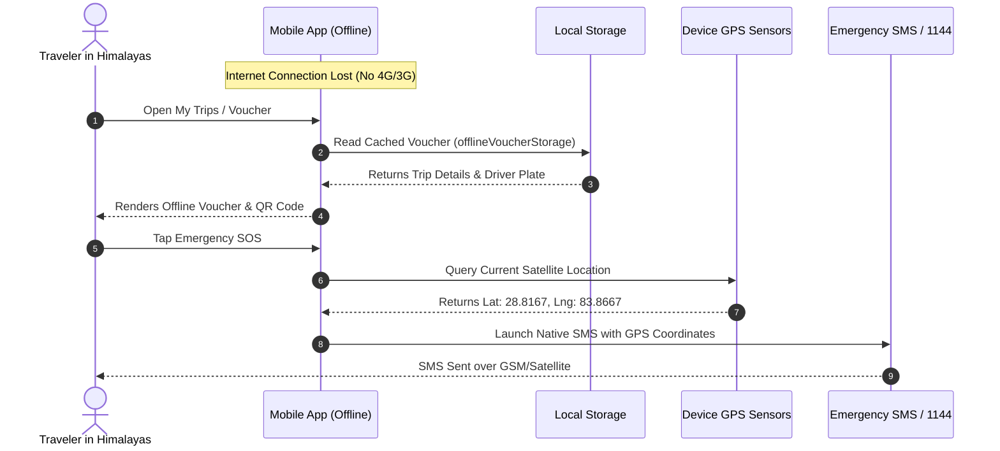

# 🏔️ Offline-First & Himalayan Resilience Strategy

[](https://drivekendra.com)
[](https://drivekendra.com)

Traveling through Nepal often involves mountainous routes with zero cellular coverage—such as the **Muktinath 4WD Trail**, **Kalinchowk Kuri Village**, **Upper Mustang**, and deep valleys along the **Prithvi Highway**.

**Drive Kendra Mobile** is engineered from the ground up with an **offline-first resilience model** to guarantee uninterrupted access to vital travel documents, emergency services, and rate estimates anywhere in the Himalayas.

---

## 📑 Table of Contents

- [The Himalayan Connectivity Challenge](#-the-himalayan-connectivity-challenge)
- [Core Resilience Components](#-core-resilience-components)
  - [1. Offline Voucher Storage (`offlineVoucherStorage.ts`)](#1-offline-voucher-storage-offlinevoucherstoragets)
  - [2. Offline QR Code Verification (`VoucherQrCode.tsx`)](#2-offline-qr-code-verification-voucherqrcodetsx)
  - [3. Emergency SOS & Offline GPS Capture (`EmergencyTripCard.tsx`)](#3-emergency-sos--offline-gps-capture-emergencytripcardtsx)
  - [4. Dynamic Offline Action Queue (`offlineQueue.ts`)](#4-dynamic-offline-action-queue-offlinequeuets)
  - [5. Bundled Offline Content & Rate Charts](#5-bundled-offline-content--rate-charts)
  - [6. Network Status Listener (`useNetworkStatus.ts`)](#6-network-status-listener-usenetworkstatusts)
- [Data Flow During Offline Operations](#-data-flow-during-offline-operations)
- [Testing Offline Scenarios](#-testing-offline-scenarios)

---

## ⛰ The Himalayan Connectivity Challenge

Standard mobile applications fail in remote mountainous regions because they depend on persistent cloud connectivity for:
- Retrieving ticket and voucher confirmations at police checkpoints or toll gates.
- Accessing emergency phone numbers or vehicle plate information.
- Verifying negotiated rental rates with local drivers.
- Handling network disconnects during form submission (resulting in duplicate charges or dropped requests).

Drive Kendra Mobile eliminates these points of failure through localized caching, optimistic UI updates, and hardware sensor integration.

---

## 🛠 Core Resilience Components

```
┌────────────────────────────────────────────────────────────────────────┐
│                          Himalayan Offline Stack                       │
├────────────────────────────────┬───────────────────────────────────────┤
│  Component                     │ Role & Implementation                 │
├────────────────────────────────┼───────────────────────────────────────┤
│  offlineVoucherStorage.ts      │ Persistent encrypted trip storage     │
│  VoucherQrCode.tsx             │ Standalone ticket verification        │
│  EmergencyTripCard.tsx         │ GPS location + SMS emergency dispatch │
│  offlineQueue.ts               │ Action replay queue on reconnect      │
│  rateCategories.generated.ts   │ 100% offline official rate matrix     │
│  useNetworkStatus.ts           │ Real-time connectivity state banner   │
└────────────────────────────────┴───────────────────────────────────────┘
```

---

### 1. Offline Voucher Storage (`offlineVoucherStorage.ts`)

When a reservation is confirmed or viewed in the app, its metadata (booking ID, driver name, vehicle plate, itinerary, emergency numbers) is automatically serialized and cached in local storage:

- **Storage Adapter**: AsyncStorage with secure JSON serialization.
- **Cache Policy**: Stored indefinitely until explicitly cleared or replaced.
- **Failover**: If the backend API is unreachable, the **MyTrips** screen seamlessly displays cached vouchers with an `Offline Mode` indicator badge.

---

### 2. Offline QR Code Verification (`VoucherQrCode.tsx`)

At high-altitude checkpoints, tourist police posts, or national park entry gates (e.g. Annapurna Conservation Area Project - ACAP), drivers or officials can verify passenger bookings via QR code without an active internet connection.

- **Payload Structure**:
```json
{
  "ref": "DK-2026-0042",
  "customer": "Samman Shakya",
  "vehicle": "Mahindra Scorpio 4x4",
  "plate": "Ba 12 Cha 3456",
  "route": "Kathmandu -> Muktinath",
  "date": "2026-09-01",
  "status": "Confirmed"
}
```
- Rendered natively using `react-native-svg` and high-contrast error-correcting QR symbology.

---

### 3. Emergency SOS & Offline GPS Capture (`EmergencyTripCard.tsx`)

In emergency situations (e.g. landslides, breakdowns, altitude sickness), travelers can trigger immediate assistance directly from the app:

1. **Hardware GPS Extraction**: Queries `expo-location` with high-accuracy satellite polling.
2. **Offline Coordinate Conversion**: Extracts latitude, longitude, and elevation.
3. **SMS Dispatch Bridge**: Pre-populates native SMS/MMS messages with formatted emergency GPS links to Drive Kendra's 24/7 hotline (`+977 985-1363783`) and tourist police (`1144`).

```
EMERGENCY SOS - DRIVE KENDRA
Booking Ref: DK-2026-0042
Passenger: Samman Shakya (+977 9851363783)
Current GPS: 28.8167° N, 83.8667° E (Jomsom-Muktinath Pass)
Maps Link: https://maps.google.com/?q=28.8167,83.8667
```

---

### 4. Dynamic Offline Action Queue (`offlineQueue.ts`)

If a user submits a review or updates their preferences while offline:
- The mutation is queued in `src/api/offlineQueue.ts`.
- The UI reflects the change optimistically.
- As soon as the device regains internet connection, the queue drains automatically in FIFO sequence.

---

### 5. Bundled Offline Content & Rate Charts

All mission-critical content is pre-compiled into TypeScript bundles during the build phase:
- **`src/content/rateCategories.generated.ts`**: Complete Nepal Government & NTVA rate chart across 7 provinces.
- **`src/content/tourDetails.ts`**: Comprehensive itineraries, packing guides, and pax rate calculators for Muktinath, Kalinchowk, Manakamana, Pokhara, and Chitwan.
- **`src/content/faqs.ts`**: Emergency procedures, cancellation rules, and luggage limits.

No API roundtrip is required to view these catalogs.

---

### 6. Network Status Listener (`useNetworkStatus.ts`)

Utilizes `@react-native-community/netinfo` to provide instant feedback to the user:
- Displays a non-intrusive banner when connectivity drops.
- Automatically retries pending background requests when network status flips back to `isConnected: true`.

---

## 🔄 Data Flow During Offline Operations



---

## 🧪 Testing Offline Scenarios

1. **Simulate Airplane Mode**:
   - On Android Emulator: Toggle Airplane Mode via Extended Controls (`...` ➔ `Cellular` ➔ `Data status: Denied`).
   - On iOS Simulator: Toggle Wi-Fi off or disable network interfaces via Network Link Conditioner.
2. **Verify Screen Behavior**:
   - Open **Rates Screen**: Ensure all 7 provinces load instantly.
   - Open **My Trips**: Verify cached voucher loads with driver contact info.
   - Open **Emergency Assistance**: Tap GPS SOS to ensure pre-populated SMS payload is generated.
